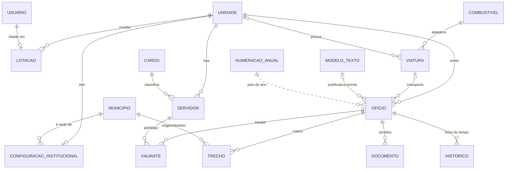

# Entidades

Legenda: **✓** existe no código novo · **~** existe parcialmente/de outra forma · **—** planejado.

## Modelo do piloto (novo)

## Viagens — Ofício e afins

| Entidade | Campos-chave | Invariantes | Novo |
|---|---|---|---|
| **Oficio** | unidade, ano, numero, data_oficio, protocolo, marcador, motivo, custeio (+instituição), tipo_transporte, viatura / descrição+placa+combustível, porte_arma, sede, justificativa (+modelo), diarias_total/resumo/calculo/erro, situacao, versao, criado/emitido/cancelado_em, motivo_cancelamento | (ano, numero) único; numero > 0; protocolo vazio ou 9 dígitos; emitido tem `emitido_em`; cancelado tem motivo; diárias ≥ 0; data do ofício no ano do número (serviço) | ✓ |
| **Viajante** | oficio, servidor, motorista, ordem | servidor uma vez por ofício; **no máximo um motorista** | ✓ |
| **Trecho** | oficio, ordem, origem, destino, saida_em, chegada_em | ordem única; chega depois de sair; origem ≠ destino; contíguos (serviço); último volta à sede (cálculo) | ✓ |
| **Documento** | oficio, tipo (ofício/justificativa), versao, situacao (gerando/pronto/falhou), dados (instantâneo), arquivo, sha256, tamanho, emitido_por | (ofício, tipo, versão) único; pronto tem hash; **nunca alterado** | ✓ |
| **Historico** | oficio, acao, descricao, usuario, em, dados | linha do tempo de negócio | ✓ |
| **NumeracaoAnual** | ano (único), piso | serializa a reserva de número (lock na linha) | ✓ |
| **LacunaNumeracao** | ano, número (únicos juntos) | número liberado pela exclusão de um rascunho; único tipo reaproveitado (D5); consumido ao reservar | ✓ |
| Justificativa (entidade própria 1:1) | modelo, texto, obrigatória, dias de antecedência, prazo, 1ª saída, status, assinante, data | — | ~ (campos no Oficio; instantâneo no Documento) |
| Roteiro / RoteiroDestino / RoteiroTrecho / RoteiroDiariaComponente | roteiro reutilizável; composição auditável das diárias | recalcular substitui tudo numa transação | ~ (Trecho + `diarias_calculo`) |
| DistanciaMunicipios | cache de distância/duração (fonte) | — | — |
| OficioNumeroLacuna | números liberados | — | ~ (lacuna = buraco entre ocupados) |
| AssinaturaConfiguracao / AssinaturaSubstituicao | assinante por tipo, substituto por período | — | — (chefia fixa na configuração) |
| Viagem, EquipePrevista | agregado da viagem | cancelar cascateia | — |
| TermoAutorizacao | ofício/viagem, destinos, datas, servidores, viatura | — | — |
| OrdemServico | número/ano, viagem, ofícios, destinos, servidores, tipo de necessidade, funções | numeração anual com lacunas | — |
| PlanoTrabalho (+EventoPlano, Efetivo, Atividade, Resultado) | número/ano/sufixo, status, programa, destinos, metas | — | — |
| PrestacaoContas, PrestacaoServidor, PrestacaoDocumentoAnexo, RelatorioTecnico, DiarioBordo(+Trecho), LinkDiarioCampo, LancamentoDiarioCampo, ImportacaoProcesso, CarimboSolicitacao | prestação por ofício/servidor | lançamentos idempotentes por `cliente_id`; remoção lógica | — |

## Cadastros

| Entidade | Campos-chave | Invariantes | Novo |
|---|---|---|---|
| **Unidade** | sigla, nome, ativo | nome único (sem caixa) | ✓ |
| **Cargo** | nome, ativo | nome único | ✓ |
| **Combustivel** | nome, ativo | — | ✓ |
| **Servidor** | nome, cpf, rg, cargo, unidade, telefone, ativo | CPF vazio ou 11 dígitos, único quando informado; PROTECT em ofícios | ✓ |
| **Viatura** | placa, modelo, combustível, tipo (caracterizada/descaracterizada), unidade, motoristas habituais (M2M com Servidor) | placa única no formato `ABC1234`/`ABC1D23` | ✓ |
| **Municipio** | codigo_ibge, nome, uf | código IBGE único | ✓ (sem região, capital, lat/long) |
| **TabelaDiaria** | faixa, vigente_desde, valor_24h, norma | (faixa, vigência) única; valor > 0; 15%/30% **derivados** | ✓ |
| **Lotacao** | usuario (1:1), unidade | define escopo | ✓ (novo) |
| **ModeloTexto** | tipo (motivo/justificativa), nome, texto | — | ✓ (motivo ainda sem uso em tela) |
| **ConfiguracaoInstitucional** | unidade (1:1), nome no cabeçalho, sede, rodapé, chefia, destinatário, prazo_justificativa_dias (padrão 10) | obrigatória para criar ofício | ✓ |
| Cadastros de eventos | TipoEvento, Servico, Equipe, OrgaoResponsavel, Regiao, Estado, UnidadeMovel, TextoDespacho | nome único + ativo | — |

Normalização: CPF, placa e protocolo gravados só com dígitos/letras; formatação na exibição
(ex.: `formatar_cpf`, `placa_formatada`, `protocolo_formatado`).

## Plataforma e identidade

| Entidade | Campos-chave | Novo |
|---|---|---|
| **Usuario** | login (único, sem caixa), e-mail institucional (único), nome, ativo, deve_trocar_senha | ✓ |
| **TentativaAcesso** | identificador, IP, quando | ✓ |
| **EventoAuditoria** (`auditoria_evento`) | tabela, registro, operação, usuário, IP, requisição, antes/depois/alterados, hash anterior, hash | ✓ (escrita só por trigger) |
| **MensagemOutbox** | tópico, payload, chave de idempotência (única), situação, tentativas, disponível_em, último erro | ✓ |
| Setor, Modulo (acesso por setor ↔ módulo) | — | — (substituído por papéis + lotação; a confirmar para módulos futuros) |
| Notificacao, Feriado, AssinaturaAgenda, PautaSemanal, MemoriaLeitura | — | — |

## Outros módulos (Planejado)

| Módulo | Entidades principais |
|---|---|
| Eventos Sociais | SolicitacaoEvento (status, datas, município, tipo, solicitante, órgão, unidade móvel, protocolo, tipo de operação DIÁRIA/EXTRAJORNADA, motorista→Servidor, decisão DG), …Servico, …Equipe (quantidade ajustável pela DG), AnexoSolicitacao, HistoricoSolicitacao, LembreteSolicitacao |
| Coffee Break | Fornecedor, ContratoCoffeeBreak, AditivoContrato, ConfiguracaoCoffeeBreak, LoteCoffeeBreak (saldo = total − consumido), SolicitacaoCoffeeBreak (marcos financeiros; situação derivada), HistoricoCoffeeBreak, OcorrenciaEntrega, CertidaoFornecedor, LinkFornecedor (hash do token), EnvioFornecedor |
| ASCOM | DemandaEvento (1:1 com SolicitacaoEvento ao encaminhar), Tema, Palestrante, RespostaPadrao, HistoricoDemanda, Publicacao, Atendimento, Historico{Publicacao,Atendimento} |
| Documentos | DocumentoArtefato (snapshot, hash, cache), DocumentoAssinaturaVersao (append-only com revogação), DocumentoBloco, DocumentoVersaoEditada, ModeloTextoDocumento |
