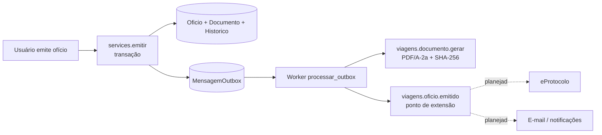

# Integrações

## Princípio no sistema novo: outbox transacional (ADR 0005)

Todo efeito colateral (PDF, e-mail, notificações, eProtocolo) é publicado com
`plataforma.outbox.publicar(tópico, payload, chave)` **na mesma transação** da mudança de
negócio. Um worker (`manage.py processar_outbox`) consome com `FOR UPDATE SKIP LOCKED`,
acorda por `LISTEN/NOTIFY`, aplica backoff exponencial (5 s → 1 h) e desiste após 8
tentativas (situação *falhou*, visível ao administrador). Assinantes são **idempotentes**; a
chave de idempotência impede publicação duplicada.

Tópicos existentes: `viagens.documento.gerar` (implementado) e `viagens.oficio.emitido`
(hoje só registra em log).

## Mapa de integrações

| Integração | Uso na referência | Situação no novo | Abordagem planejada |
|---|---|---|---|
| **eProtocolo/PR** (barramento estadual, OAuth2) | Abrir protocolo ao gravar ofício sem protocolo; consultar situação/andamento (eventos, demandas, prestação); ambientes produção/treinamento/homologação; origem do protocolo MANUAL/EPROTOCOLO/TREINAMENTO/SIMULADO; trava somente leitura para o ambiente real; nunca sobrescreve número digitado; falha vira aviso | **Não integrado**: protocolo digitado (9 dígitos, validado no formulário e no banco) | 1º: painel "dados para o eProtocolo" (campos para copiar), barato e muito usado. 2º: assinante de `viagens.oficio.emitido` (ou de gravação) abrindo protocolo, com origem registrada e falha como aviso. Envio do PDF ao processo e tramitação: pendentes também na referência |
| **Leitura de processo eProtocolo (PDF)** | Separar volume em documentos, classificar (ofício, despacho, RT, diário, comprovantes), importar em Prestação e Coffee Break | Planejado | Assinante assíncrono; prévia → aplicar/descartar/desfazer |
| **Municípios IBGE** | Comandos de importação de localidades e geocodificação | **Implementado**: lista oficial em `cadastros/dados/municipios_ibge.csv`, carregada se a tabela estiver vazia; busca por nome/UF | Atualização periódica do CSV — a confirmar |
| **E-mail (SMTP)** | Notificações, recuperação de senha, OS/OB ao fornecedor (prévia editável), link do fornecedor, pauta semanal | Não implementado (tela de notificações sem envio) | Sempre via outbox, após commit; nunca na requisição |
| **Notificações internas (sino)** | Sempre gravadas; e-mail opcional | Tela existe; conteúdo a definir | Assinantes da outbox |
| **Assinatura de documentos** | Externa (eProtocolo/gov.br) + upload do PDF assinado; conferência (`/Sig` ICP-Brasil/gov.br ou carimbo eProtocolo); versões assinadas append-only com revogação ao reabrir. Assinatura por link com token **não** está nas rotas atuais | Não implementado | Upload do assinado como versão vinculada ao `Documento` imutável; revogar ao reabrir |
| **OpenRouteService** | Rota (mapa), distâncias e tempos; cache `DistanciaMunicipios` | Não implementado | Decisão de fase (sugestão de chegada, km para diário de bordo) |
| **ViaCEP + Nominatim (OSM)** | Busca de endereço (cadastro → ViaCEP → Nominatim) com cache e limite por usuário; consulta CEP | Não implementado | A confirmar |
| **Leitura de e-mail / triagem** | "Preencher com e-mail" (.eml, .mht, .msg, PDF, texto, WhatsApp, print com OCR); classifica módulo; aprendizado por remetente/domínio | Não implementado | Elogiado na referência; planejar por módulo |
| OCR (tesseract local, opcional) | Páginas-imagem | Não implementado | Junto com leitura de e-mail/processo |
| Leitura de NF / certidões | Nº da NF do PDF, validade da certidão | Não implementado | Com o Coffee Break |
| iCalendar (ICS) | Feed por token da agenda | Não implementado | Com a Agenda |
| WhatsApp | Links `wa.me` para respostas; webhook previsto mas desligado | Não implementado | Links simples; webhook a confirmar |
| Assistente LLM | Opcional e dormente na leitura de mensagens | Não implementado | A confirmar |
| Migração de dados (ETL) | ETL idempotente do sistema antigo (origem/pk legado, dry-run, relatórios) | Não implementado | Necessário mapear: estados (GERADO/FINALIZADO → Emitido), custeio, lacunas de numeração, 15%/30% históricos, modelos com marcadores |

## Rotinas agendadas

Na referência, rotinas diárias rodam **sem cron**, disparadas no primeiro acesso do dia por
middleware (lembretes de solicitações, avisos de prestação, pauta semanal, limpeza). No
novo, efeitos rodam no worker da outbox; o agendamento de rotinas periódicas está **a
confirmar** (não há agendador no código atual).

## Segredos e ambientes

- Credenciais de integrações só por variáveis de ambiente (`.env` fora do Git); nunca em
  documentação ou código.
- Operações destrutivas apenas com `APP_ENV` em lab/dev/test; em produção as ferramentas do
  agente são somente leitura (ADR 0010).
- Integrações com ambiente real devem ter trava de somente leitura/treinamento por padrão,
  como o eProtocolo já tinha na referência.
