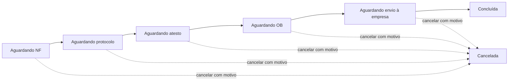
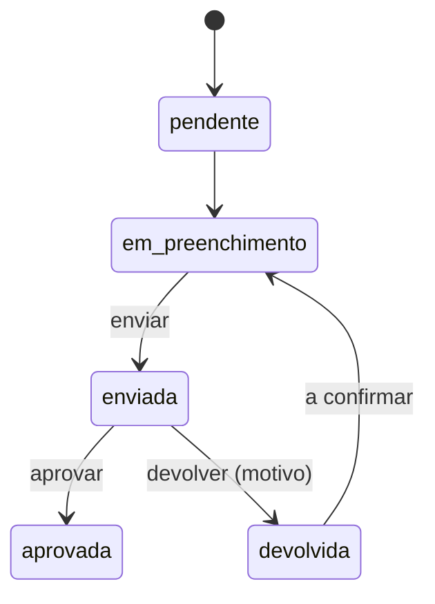

# Fluxos e máquinas de estado

## 1. Ofício de viagem (sistema novo — implementado no piloto)

### Passo a passo

| # | Passo | Regras principais | Onde (novo) |
|---|---|---|---|
| 1 | **Criar rascunho** | Exige lotação em unidade e configuração institucional da unidade. O botão "Novo ofício" (POST) já cria o rascunho, como no sistema de referência: o **número do ano é reservado na hora** (menor lacuna ≥ piso), a data do ofício é hoje e a sede é a da unidade; em seguida abre a folha completa de edição (as 7 seções). Não existe página intermediária; `GET /viagens/oficios/novo/` volta para a lista sem criar nada. | `services.criar_rascunho` |
| 2 | **Dados** | Data do ofício deve estar no ano do número; protocolo opcional (9 dígitos); marcador (nenhum/retificado/complementar); motivo; custeio (outra instituição exige o nome). Concorrência otimista por `versao`. | `services.salvar_edicao` (dados + roteiro numa transação) |
| 3 | **Equipe** | Incluir servidores ativos (sem repetição); marcar no máximo um motorista. | `adicionar_viajante`, `definir_motorista` |
| 4 | **Transporte** | Viatura oficial (exige viatura + motorista na equipe) **ou** outro meio (exige descrição; placa e combustível opcionais). Porte de arma (padrão: sim). | `salvar_edicao` |
| 5 | **Roteiro** | Até 10 destinos + retorno. Cada trecho sai de onde o anterior chegou, não sai antes da chegada anterior, chega depois de sair; o último volta à sede. | `salvar_edicao` (roteiro recusado não grava nada) |
| 6 | **Diárias** | Recalculadas automaticamente a cada mudança de equipe/trechos; erro (ex.: sem tabela vigente) aparece como pendência bloqueante. | `recalcular_diarias` |
| 7 | **Justificativa** | Obrigatória se antecedência ≤ prazo da unidade (padrão 10 dias) ou saída antes da data do ofício. Pode partir de um texto pronto. | `avaliar_prazo_do_oficio` |
| 8 | **Revisar e emitir** | Só sem pendências bloqueantes. Muda para *Emitido*, cria versão do Ofício (+ Justificativa se houver texto) com instantâneo dos dados e publica geração do PDF na outbox. | `services.emitir` |
| 9 | **PDF** | Worker gera PDF/A-2a, grava SHA-256 e registra no histórico. Antes da emissão há minuta com marca d'água. | `assinantes.gerar_documento` |
| 10 | **Reabrir** | Gestor, só de *Emitido*, com motivo obrigatório → volta a *Rascunho*; versões anteriores permanecem. | `services.reabrir` |
| 11 | **Cancelar** | Gestor, de *Rascunho* ou *Emitido*, motivo obrigatório; estado terminal; o número continua ocupado. | `services.cancelar` |
| 12 | **Excluir** | Só rascunho sem nenhum documento; libera o número. | `services.excluir_rascunho` |

### Pendências (prontidão para emitir)

| Seção | Bloqueia | Não bloqueia (aviso) |
|---|---|---|
| Dados | motivo vazio; custeio "outra instituição" sem nome | protocolo não informado |
| Equipe | nenhum servidor; viatura sem motorista indicado | conflito de agenda (servidor/viatura em outro ofício no mesmo período) |
| Transporte | viatura não escolhida; "outro meio" sem descrição | — |
| Roteiro / Diárias | sem trechos; erro de cálculo | — |
| Justificativa | obrigatória e vazia | — |

### Estados

```mermaid
stateDiagram-v2
    [*] --> Rascunho: criar (reserva número)
    Rascunho --> Rascunho: editar dados / equipe / trechos
    Rascunho --> Emitido: emitir (sem pendências bloqueantes)
    Emitido --> Rascunho: reabrir (gestor, motivo)
    Rascunho --> Cancelado: cancelar (gestor, motivo)
    Emitido --> Cancelado: cancelar (gestor, motivo)
    Rascunho --> [*]: excluir (sem documentos; libera número)
    Cancelado --> [*]
```

### Referência (para comparação)

```mermaid
stateDiagram-v2
    [*] --> RASCUNHO
    RASCUNHO --> GERADO: gerar DOCX/PDF (ainda editável)
    GERADO --> FINALIZADO: finalizar (exige protocolo)
    FINALIZADO --> GERADO: reabrir (motivo; revoga assinados)
    FINALIZADO --> ARQUIVADO: arquivar
    note right of RASCUNHO : cancelar/reativar é flag ortogonal; retificar e complementar são ações
```

Diferenças: novo une GERADO+FINALIZADO em *Emitido* (D4, a confirmar), cancelamento é
terminal (sem reativar), não há arquivar; protocolo bloqueia a emissão (D1, como a referência).

## 2. Solicitação de Evento Social (Planejado)

```mermaid
stateDiagram-v2
    [*] --> RASCUNHO
    RASCUNHO --> AGUARDANDO_DESPACHO: enviar (autor; valida serviços/equipes)
    AGUARDANDO_DESPACHO --> DEFERIDA_EM_ANDAMENTO: despachar ATENDER (DG) → gera Viagem(ns)
    AGUARDANDO_DESPACHO --> DEVOLVIDA: devolver (DG, observação)
    DEVOLVIDA --> AGUARDANDO_DESPACHO: reenviar (autor)
    AGUARDANDO_DESPACHO --> NAO_ATENDIDA: NAO_ATENDER (DG)
    DEFERIDA_EM_ANDAMENTO --> ATENDIDA: concluir (autor, após fim do evento)
    AGUARDANDO_DESPACHO --> CANCELADA: cancelar (autor/DG/admin, motivo)
    DEVOLVIDA --> CANCELADA
    DEFERIDA_EM_ANDAMENTO --> CANCELADA
```

- Editar em AGUARDANDO_DESPACHO/DEFERIDA reenvia para despacho (diff no histórico).
- DG pode só ajustar quantidade de servidores por equipe; o resto devolve para correção.
- Se a geração de Viagem falhar no deferimento, notifica com "Tentar de novo".
- Também: transferir autoria (com motivo), duplicar (novo rascunho), excluir (só rascunho).
- Lembretes diários: confirmar atendimento após o fim; DG com evento em ≤ 7 dias aguardando
  despacho; devolução parada há > 3 dias.

## 3. Coffee Break — situação financeira (Planejado)

Situação **derivada** dos marcos preenchidos (nunca gravada):

- Etapas de tela: 1) Solicitação e OS → e-mail ao fornecedor; 2) NF, ofício ao GAF e
  certifico; 3) protocolo e pagamento (pacote só com tudo pronto e certidões vigentes) → OB.
- Regras: cronologia dos marcos validada; dados-base congelados após início financeiro;
  concluída/cancelada somente leitura; reativar revalida saldo do lote sob bloqueio;
  reabrir concluída só admin do módulo.
- Portal do fornecedor: link por token (expira, revogável) → envio RECEBIDO → ACEITO/RECUSADO.

## 4. Demanda ASCOM — Palestras (Planejado)

Status: PENDENTE, EM_ANDAMENTO, AGUARDANDO_RETORNO, EVENTO_AGENDADO, ATENDIDA, CANCELADA.
Transição livre via modal "andamento", **exceto ATENDIDA só após a data do evento**; o modal
pede apenas o dado faltante. "Encaminhar à DG" cria Solicitação de Evento rascunho (1:1).
Pedido público entra com canal PORTAL e token de acompanhamento.

## 5. Publicações e Atendimento à imprensa (Planejado)

- Publicação: `PENDENTE → EM_ANDAMENTO → PUBLICADA | CANCELADA`.
- Atendimento: situações abertas (em andamento texto/vídeo, aguardando fonte, aguardando
  produtora, aguardar nova solicitação, próximo mês) × encerradas (atendido, não responder);
  prazo (`deadline`).

## 6. Viagem, roteiro, termos, OS, PT (Planejado)

| Objeto | Estados | Observações |
|---|---|---|
| Viagem | rascunho → em preparação → documentos gerados → em execução → finalizado; cancelado | cancelar cascateia aos documentos; reativar os traz de volta; dados propagam para documentos novos |
| Roteiro | RASCUNHO/FINALIZADO; cálculo PENDENTE/CALCULADA/DESATUALIZADA | recalcular substitui a composição inteira; sem tabela vigente → erro |
| Termo, OS | cancelar/reativar/excluir | OS com numeração anual e lacunas |
| Plano de trabalho | RASCUNHO/GERADO | numeração anual + sufixo |

## 7. Prestação de contas (Planejado)

- Stepper por servidor: diário de bordo → RT → documentos → PDF final; arquivar, finalizar
  (com justificativa), remover reversível; travada após finalização.
- Importação do processo eProtocolo (PDF): analisada → aplicada/descartada; desfazer.
- Diário de campo (celular do motorista, offline): link por token gerado/revogado/expira;
  lançamentos idempotentes (gravado/recusado).
- Avisos: diárias liberadas, saque vence em N dias, saque vencido, prestação vencida
  (3 dias úteis após fim do saque), documentos recebidos.
